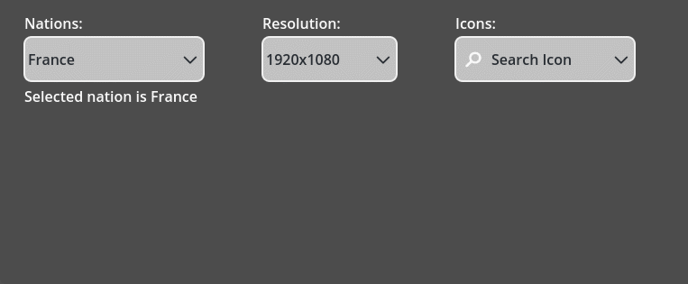
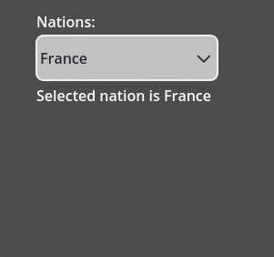

# BRANE Godot Dropdown

A custom made dropdown element made for my Master of Chess game: https://store.steampowered.com/app/2248900/Master_of_Chess

The built-in dropdown (OptionButton node) didn't support icons so I had to implement my own.



## How to use?

Add the dropdown_control.tscn scene anywhere in your tree. Set the dropdown elements from code:

```
    var resolution_dropdown_items : Array[DropdownItem] = [
		DropdownItem.new(Vector2(1920, 1080), "1920x1080", null),
		DropdownItem.new(Vector2(1080, 720), "1080x720", null),
		DropdownItem.new(Vector2(640, 400), "640x400", null),
		]
	%ResolutionsDropdownControl.set_items(resolution_dropdown_items)
```

Dropdown item is a class that requires three arguments in the constructor:
- **value**: any Variant
- **label**: the text displayed inside the dropdown
- **texture**: the icon displayed next to the selected element

## Search functionality

When there's many items in the dropdown component the user can filter the options by typing:

